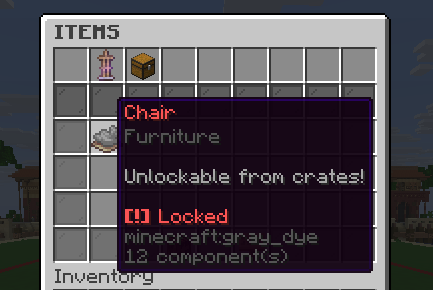
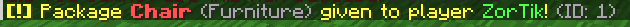
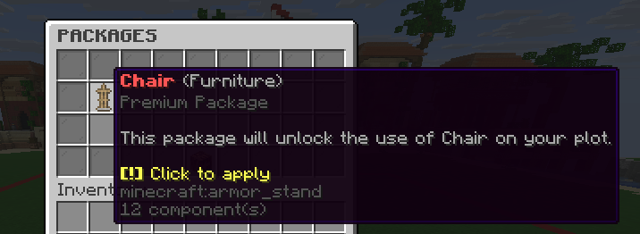

Welcome to this fancy guide, fellow Housing admin! This time, we would like to show you how you can
utilize [Packages](../features/package.md) to **give your players rewards they can apply on their plots**.

There are many use cases for giving players a packages:

- Players **buy a package from your store** that runs the package give command
- Players **win a package from a crate** that runs the package give command
- You just **give it to them using DeluxeMenus or any other plugin** as basic progression reward

## Step 1 - Figuring out (and preparing) the reward

Before you define a package, you may need to figure out what effect you want it to give to the plot after
the player applies it.

Packages can run **console or player commands**, so it can be basically anything unlockable by commands.

Here are some examples:

- You can **unlock [Locked Items](../features/locked-item.md)** using the [`/plot admin item unlock`](../commands/plot/admin/item.md) command.
- You can **unlock [Features](../features/feature.md)** using the [`/plot admin feature activate`](../commands/plot/admin/feature.md) command if the feature is marked as locked by default or just force-activate it if it costs some.
- You can **apply [Amplifiers](../features/amplifier.md)** to the plot.

In this guide, we will be giving players **furniture as a reward from crates**.

First, we need to define the [Item](../features/item.md) in the `items.global.yml` file so it can be displayed in the
Items menu on every plot:

```yaml
# items.global.yml

categories:
  # Define a category where the furniture will be displayed in the menu.
  furniture:
    name: "Furniture"
    description: "Furniture that you can place on your plot"
    icon: ARMOR_STAND
    items:
      furniture-chair:
        # The 'item' subsection defines the display appearance in the GUI.
        item:
          icon: PAPER
          custom-model-data: 123456
          lore:
            - "<red>Chair"
            - "<dark_gray>Furniture"
            - ""
            - "<gray>Unlockable from crates!</gray>"
            - ""
            - "<yellow><b>[!]</b> Click to obtain</yellow>"
        item-locked:
          icon: GRAY_DYE
          lore:
            - "<red>Chair"
            - "<dark_gray>Furniture"
            - ""
            - "<gray>Unlockable from crates!</gray>"
            - ""
            - "<red><b>[!]</b> Locked</red>"
        obtainable-without-privileges: false
        # Sets whether the item is locked on the plot by default (requires unlocking)
        locked: true
        tag: "furniture_pack"
        price:
          buyable: false
          amount: 0
        selector:
          # Pairs this locked item with a physical in-game furniture item that has this custom-model-data value.
          custom-model-data: 123456
        # Actions executed when a player clicks on the unlocked item in the menu to obtain it.
        on-obtain:
          - type: command
            data:
              sender: console
              # Placeholders that you can use here: %player%, %plot%
              command: "nexo give chair 1 %player%"
          - type: message
            data:
              message:
                - '<yellow><b>[!]</b> Obtained a Chair!</yellow>'
```

This adds the item in the items menu on every plot.



## Step 2 - Defining a premium package

Next, we need to define the package that will (after being applied by player), unlock the locked item by command on the plot:

```yaml
# packages.global.yml

packages:
  unlock-furniture:
    # The package key is used to identify the package in commands
    key: unlock-furniture
    # Input options are variables that you may pass when giving the
    # package to a player
    input-options:
      - name: furniture_item_id
        type: string
      - name: name
        type: string
    # Single line display name shown in the menus
    display-name: "<red><b>%name%</b></red> <gray>(Furniture)</gray>"
    # Item shown in the Packages Menu (before applying the package)
    item:
      material: ARMOR_STAND
      lore:
        - "<red><b>%name%</b></red> <gray>(Furniture)</gray>"
        - "<dark_gray>Premium Package</dark_gray>"
        - ""
        - "<gray>This package will unlock the use of %name% on your plot.</gray>"
        - ""
        - "<yellow><b>[!]</b> Click to apply"
    on-apply:
      - type: command
        data:
          sender: console
          # Placeholders that you can use here:
          # %player%, %plot%, %furniture_item_id%, %name%
          # (and any other that you define in the input-options)
          command: "plot admin item unlock %furniture_item_id%"
      - type: message
        data:
          message:
            - "<yellow><b>[!]</b> Unlocking the <red>%name%</red> item has been successfully applied to your plot!</yellow>"
```

## Step 3 - Applying the configuration

To apply the changes, please follow [this guide](../installation/configuration.md#changing-global-files) and then return to this
page to continue with the next steps.

## Step 4 - Adding the package to the crates reward pool

To give a player this package (on lobby for example), with the Chair as a target, you just run this command:

```
/housing admin package give <player> unlock-furniture furniture_item_id=furniture-chair,name=Chair
```

> TIP: As you can see, we passed the input options defined in the package configuration.
> You can pass any value you want, so you can create a package that unlocks different furniture items
> depending on the input options you pass when giving the package to the player.



// TODO: configuring the crates reward with placeholders, the give command, etc.

## Step 5 - Player obtains the package and applies it

Now when the player has obtained the package from the crate, they may want to find a plot where they want to apply
the package. They open the *Packages Menu* on the plot where are located all packages they own and apply the package.



This is how it looks from the perspective of the player after they obtained the package and have the package in the
packages menu. They can click on the package to apply it to the plot and unlock the furniture item.

For more information, refer to the [Package](../features/package.md) page.